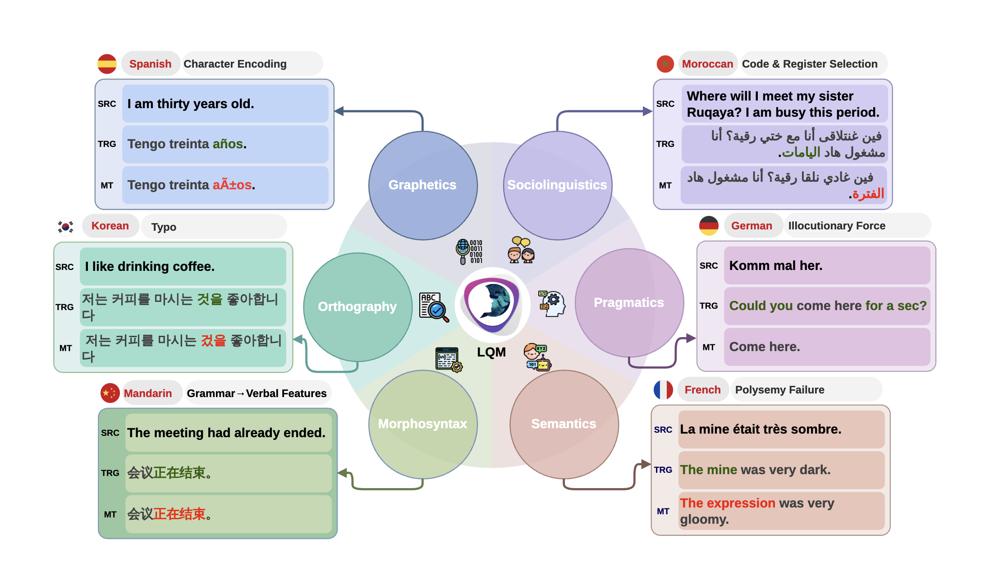

<div align="center">

# LQM

### Linguistically Motivated Multidimensional Quality Metrics for Machine Translation

[](https://arxiv.org/abs/2604.18490)
[](#)
[](#)

**A linguistically grounded framework for diagnosing machine translation quality.**

</div>

---

## Overview

**LQM** is a linguistically motivated, multidimensional framework for analyzing machine translation quality.

This repository accompanies the paper:

> **LQM: Linguistically Motivated Multidimensional Quality Metrics for Machine Translation**  
> Findings of ACL 2026

Paper: [arXiv:2604.18490](https://arxiv.org/abs/2604.18490)

---

## Framework

<p align="center">
  
</p>

LQM analyzes translation quality across six linguistic dimensions:

| Level | Focus |
|---|---|
| Sociolinguistics | Dialect, register, variety, and social appropriateness |
| Pragmatics | Context, intent, implicature, and communicative function |
| Semantics | Meaning preservation, omission, addition, and mistranslation |
| Morphosyntax | Grammar, agreement, word order, and structure |
| Orthography | Spelling, punctuation, and writing conventions |
| Graphetics | Script-level and visual-form issues |

---

## Resources

| File | Description |
|---|---|
| [`PROMPT.md`](PROMPT.md) | Translation prompt used in the experiments |
| [`LQM-Annotation-Guidelines.pdf`](LQM-Annotation-Guidelines.pdf) | Annotation guidelines for applying LQM |

---

## Citation

If you use LQM or this repository, please cite:

```bibtex
@misc{magdy2026lqmlinguisticallymotivatedmultidimensional,
  title         = {LQM: Linguistically Motivated Multidimensional Quality Metrics for Machine Translation},
  author        = {Samar M. Magdy and Fakhraddin Alwajih and Abdellah El Mekki and Wesam El-Sayed and Muhammad Abdul-Mageed},
  year          = {2026},
  eprint        = {2604.18490},
  archivePrefix = {arXiv},
  primaryClass  = {cs.CL},
  url           = {https://arxiv.org/abs/2604.18490}
}